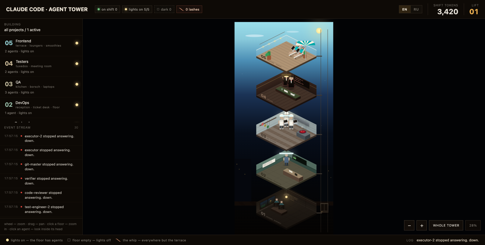

# Agent Tower

An isometric office tower that shows the Claude Code agents running on this machine, live.
Every session and every subagent gets a body, a floor and a desk; click one to read what it is
thinking and which tools it has called.



## Run it

```bash
npm install
npm start
```

That builds the frontend, starts the server on `http://localhost:7788` and opens a browser.
On the first run it asks once for a DeepSeek API key (hidden input); press Enter to skip and
run on the built-in heuristic classifier instead. The key is stored in
`~/.agent-tower/config.json` with mode `600`.

```
--port <n>            preferred port (default 7788, increments while busy)
--no-open             do not open a browser
--projects-dir <p>    transcripts root (default ~/.claude/projects)
--deepseek-key <k>    DeepSeek API key
--no-ai               heuristic classifier only
```

Key resolution order: `--deepseek-key` → `DEEPSEEK_API_KEY` → config file → interactive prompt.

The server binds `127.0.0.1` only and sets no CORS headers. Transcripts contain full prompts and
source code; nothing leaves the machine.

## How it works

Claude Code has no event API. What it does have is append-only JSONL transcripts:

```
~/.claude/projects/<slug>/<session-uuid>.jsonl
~/.claude/projects/<slug>/<session-uuid>/subagents/agent-<agentId>.jsonl (+ .meta.json)
```

```
~/.claude/projects/**/*.jsonl
        │  chokidar: add / change (120ms debounce per file)
        ▼
  TailReader — reads from a saved byte offset, never the whole file
        │
        ▼
  parseLine — JSON.parse + zod; a broken line is counted, not fatal
        │
        ▼
  Normalizer — transcript lines → agents, tool calls, thinking, usage
        │
        ├──► Classifier — heuristic always, DeepSeek when configured → floor
        ▼
  Store (in memory) ──► SSE /api/stream ──► browser
        └──────────► GET /api/state (snapshot on connect and on resync)
```

The SSE stream in that diagram is **ours** — server to browser. Claude Code is upstream of it.

### Agents

An agent is one executing unit:

- a **session** — one per `<session-uuid>.jsonl`, named `<project>·<hash>`;
- a **subagent** — one per `Agent`/`Task` tool call. Claude Code writes these to their own
  transcript with a `.meta.json` sidecar, so the pipeline reconciles the parent's tool call with
  the child's transcript and counts each subagent exactly once whichever it sees first.

Names follow `subagent_type` → `description` → session name, kebab-cased; a collision gets a
numeric suffix so two `executor`s stay tellable apart.

### Status

Recomputed from memory every 5s — no disk access:

| status | condition |
|---|---|
| `work` | last event < 60s ago and the tool cycle is still open |
| `wait` | a final assistant answer with no tool call, or 60s–15min idle |
| `dead` | an error, or 15min+ idle |
| gone | the agent stands up, walks to the lift and rides down |

An agent goes for four reasons, and the event feed says which:

- **finished** — it answered with no tool call and stayed quiet for 3 minutes. The turn is
  over, so it does not sit out the full idle timeout;
- **its Task returned** — a subagent closes the moment its `Agent` tool call comes back, with
  no timeout at all;
- **closed** — its session transcript was deleted. That is the one unambiguous "session over"
  the format gives us, and it takes the session's subagents with it;
- **idle** — 30 minutes of silence, whatever it was doing.

### Floors

| floor | who lives there |
|---|---|
| 05 Frontend | terrace, loungers, smoothies |
| 04 Testers | tuxedos, meeting room |
| 03 QA | kitchen, borsch, laptops |
| 02 DevOps | reception, ticket desk |
| 01 Backend | basement, window on the dump |
| 00 Shift change | overflow only — appears when a floor runs out of seats |

Nobody appears in their chair. An arriving agent calls the lift, waits inside the car until
its doors are open on the right floor, then steps out and walks to its seat; a leaving one
stands up, walks back and the doors close over it. Both walks are timed against the car
itself — the store answers `sendLift` with *when the doors will be open* and the walk is timed
backwards from that number — so nobody crosses a floor towards a shut door. A burst of agents
queues more trips than anyone will watch, so past three seconds the agent stops waiting for
its turn and simply walks in.

Placement is an isometric grid inside each 760×600 plate, minus a per-floor furniture mask:
12 seats per themed floor, 24 on floor 00. A full floor pushes its *waiting* agents to floor 00;
working agents keep their seats, and everyone comes back up as soon as a seat frees.

Every project shares one building. Lighting is not a control: a floor with agents is lit, an
empty one is dark.

### Classification

The heuristic runs on every new piece of evidence — file extensions, tool names, agent type — and
is the only classifier when there is no key or no network. DeepSeek, when configured, refines it:
batched (up to 8 agents per call, 400ms window), at most 4 requests in flight, answers validated
against a zod schema, `confidence < 0.55` treated as `unknown`, and results cached in
`~/.agent-tower/classify-cache.json` for 30 days. An unclassified agent starts in the basement
with a dashed name plate and moves once a verdict arrives.

### Inside the head

Clicking an agent subscribes the browser to its thinking and tool stream. Both columns are a
window on the *end* of the history: the newest row is on screen immediately and older ones unfold
behind it, one per 850ms. Tool calls read newest-first, because the call an agent is running right
now is what the panel is opened for.

The panel is portalled onto `document.body` rather than rendered inside the canvas. The canvas is a
pan/zoom surface — `touch-action: none` and a non-passive wheel handler — so a modal nested in it
has its scrolling eaten by the zoom gesture before either column sees it. Reasoning holds its
bottom edge as older lines unfold, but only while you are already down there.

An empty column says which kind of empty it is — still loading, the agent has left, or it
genuinely has nothing to show yet. A single placeholder for all three made every quiet agent
look like the same agent.

One caveat, and it is upstream of us: Claude Code writes `thinking` blocks to the transcript with
the text stripped out — only the signature survives. So the reasoning column shows the agent's
assistant text, which is all the transcript actually contains.

## Development

```bash
npm run dev:server     # API + SSE on 7788, no browser
npm run dev:web        # Vite dev server on 5173, proxies /api
npm test               # vitest
npm run typecheck
```

### Replaying a session

Live agent streams are awkward to reproduce, so transcripts can be replayed at wall-clock speed
into a scratch projects directory:

```bash
npm run replay -- fixtures/pipeline.jsonl --speed 4 --out /tmp/tower-replay
node bin/agent-tower.mjs --no-ai --projects-dir /tmp/tower-replay
```

`fixtures/pipeline.jsonl` is a nine-agent pipeline spread across all five floors;
`fixtures/overflow.jsonl` sends fifteen agents at the basement to exercise floor 00.

## Layout

```
bin/agent-tower.mjs     CLI entry point
server/
  index.js              Fastify app, routes, SSE
  watcher.js            chokidar over ~/.claude/projects
  tail-reader.js        byte-offset incremental reads
  jsonl.js              zod schemas for transcript lines
  normalizer.js         lines → agents, tools, thinking
  store.js              world state, statuses, placement, event feed
  floors.js             floor table and isometric slot geometry
  sse.js                ring buffer, Last-Event-ID replay, throttling
  classifier/           heuristic, DeepSeek client, cache, agent docs
  replay.js             fixture playback
web/src/
  scene/                per-floor scenery, transcribed from the design
  components/           header, sidebar, canvas, floors, characters, inspector
  store/tower.ts        client state (zustand)
  i18n/                 en + ru dictionaries
```

## Language

The interface opens in English and switches to Russian from the header. The Russian strings are
the design's own copy, kept verbatim; the server only ever sends codes and enums, so every
readable string — including the event feed — is assembled on the client and re-reads correctly
when the language changes.

## Design

`design_handoff_agent_tower/Agent Tower.dc.html` is the reference. Deliberate departures from it:

1. **No per-floor light switch.** Lighting follows occupancy, so there is nothing to toggle. The
   footer legend stays.
2. **The whip and its counter are decoration.** A timer cracks it every 20–45s at a random
   non-terrace floor; nothing about it touches an agent's real state.
3. **Floor 00 is new.** The design has five floors; overflow needs a sixth. It inherits floor 01's
   construction with a neutral accent and appears only when it holds someone.
4. **The sidebar header is dynamic** — `all projects / N active` rather than a fixed building name.
5. **"Whole tower" really fits the tower**, measured from the lowest floor rather than the
   prototype's fixed constant.
6. SSE is written directly on the Fastify reply rather than through `fastify-sse-v2`: the plugin's
   async-iterator model fights a push hub with a replay buffer, and this is a dozen lines.

### Geometry corrections

The prototype renders one static frame, so a few things that only show up in a scrolling,
lit-and-dark tower were wrong in it and are fixed here:

- **Floors stack upward.** A floor is 600px tall on a 470px step, so every wrapper overlaps the one
  below. In this projection the upper floor's slab *is* the lower floor's ceiling, so it has to
  paint over it — floor 05 sits above floor 04, not behind it.
- **The "lights off" curtain covers the whole floor.** Its clip-path stopped at the plate diamond
  and left the 20px slab rim outside, so a dark floor kept a lit edge; the opacity was also tuned
  against dark rooms and left floor 03's white tiles and floor 02's white sign readable.
- **Wall furniture is on its wall.** The QA cupboard, the DevOps ticket board and the Testers
  scoreboard were all positioned a little above their wall's top edge and hung in mid-air, outside
  the room. The DevOps reception desk ran past the plate's front-right edge and over the void.

Floor 05's parasol, garland and planters do rise above its railing — that one is a terrace, not a
walled room, and the design means it.
